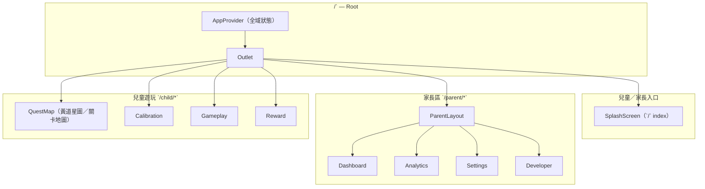
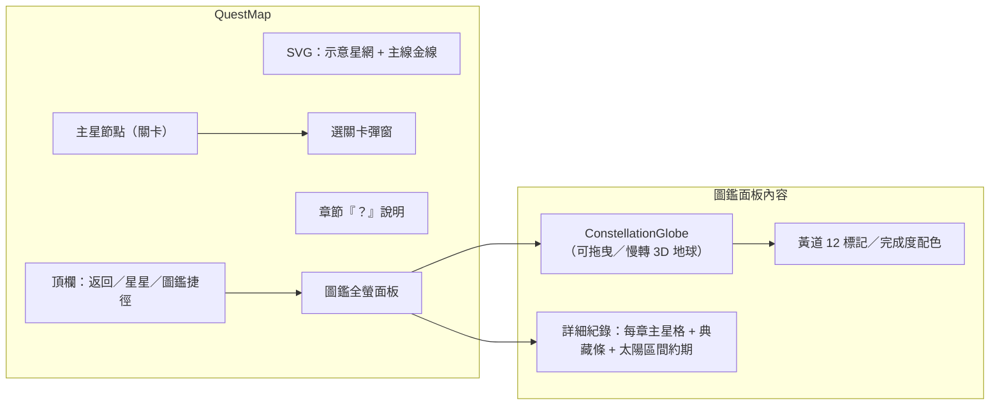
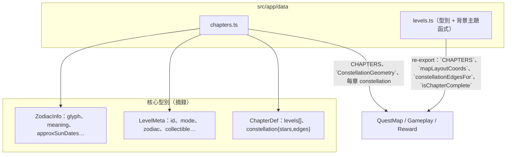
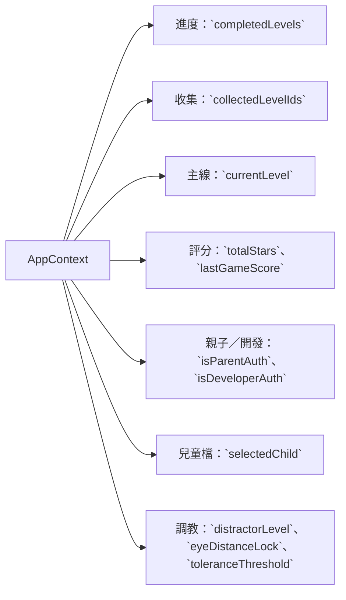

# Authentication and Dashboard Design — 系統架構（最新）

> 對應目前程式：**React 18 + Vite 6 + React Router 7**。此檔為單一事實來源，後續改路由／狀態／大地圖行為請同步更新圖。

## 總覽（路由／版面）

### 路由對照（`src/app/routes.tsx`）

| Path | 畫面 | 備註 |
|------|------|------|
| `/` | `SplashScreen` | PIN／兒童進入、`/child/lobby`、`/parent` |
| `/parent` | `Dashboard` | `ParentLayout` 子項 index |
| `/parent/analytics` | `Analytics` | |
| `/parent/settings` | `Settings` | |
| `/parent/dev` | `Developer` | 開發 PIN 後進入 |
| `/child/lobby` | `QuestMap` | 十二星座章節、星圖、圖鑑 |
| `/child/calibration` | `Calibration` | |
| `/child/play` | `Gameplay` | query：`mode`、`level` |
| `/child/reward` | `Reward` | |

---

## QuestMap／圖鑑（最新交互）

- **已完成判定（地球環上綠標）**：`isChapterComplete(chapter, completedLevels)`（該星座全部主星 `level.id` 皆在 `completedLevels`）。
- **圖鑑格子解鎖顯示**：`collectedLevelIds` 或 `completedLevels`（與典藏條計數一致；典藏在 UI 上以章內統計呈現）。

---

## 資料與關卡模型

---

## 全域狀態（`AppContext`）

下游主要消費者：`QuestMap`、`Gameplay`、`Reward`、`SplashScreen`、`Settings` 等頁。

---

## 目錄導覽（常改檔）

| 路徑 | 用途 |
|------|------|
| `src/app/routes.tsx` | 路由器設定 |
| `src/app/context/AppContext.tsx` | 全域狀態 |
| `src/app/data/chapters.ts` | 12 星座章節資料、星圖座標／邊、`LEVELS_META` |
| `src/app/data/levels.ts` | 型別、`themeBackground`、`getLevelMeta`、re-export |
| `src/app/pages/QuestMap.tsx` | 星圖 UI、章節切換、圖鑑、彈窗 |
| `src/app/components/ConstellationGlobe.tsx` | 圖鑑內地球＋十二星座完成配色 |
| `src/app/pages/Gameplay.tsx` | 關卡遊玩 |
| `src/app/pages/Reward.tsx` | 通關結算／鼓勵文案 |
| `src/app/layouts/ParentLayout.tsx` | 家長區共通版面 |

---

*最後更新：配合「圖鑑 → 旋轉地球 + 黄道 12 星座完成色系 + 詳細紀錄列表」行為。*
